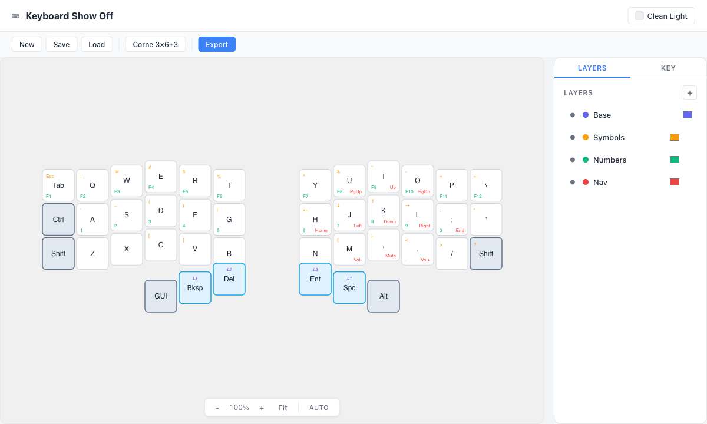
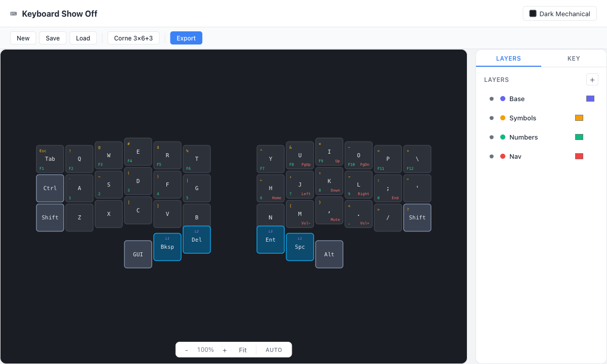

# Kbd Mapper

A browser-based visual editor for custom keyboard layouts. Create beautiful multi-layer keymap visualizations and export them as SVG, PNG, or vector PDF.

Built for the custom keyboard community (Corne, Sweep, Lily58, Iris SE/CE/LM, Planck, etc.) who want to showcase their layouts with style.





## Features

- **Multi-layer editing** — Define up to 8 visible layers with per-key bindings, hold behaviors (mod-tap, layer-tap), and colored layer indicators
- **Layer reordering** — Drag layers up/down to organize your keymap (base layer stays pinned)
- **Compact & expanded views** — Compact mode shows all layers on a single keyboard; expanded mode renders one keyboard per layer; auto mode switches based on layer count
- **9 built-in layouts** — Corne 3x6, Corne 3x5, Ferris Sweep, Lily58, Iris SE/CE/LM, Planck, ANSI 60%, ANSI TKL, Kyria
- **5 built-in themes** — Clean Light, Dark Mechanical, Warm Paper, Colorful, High Contrast
- **Export** — SVG, PNG (1x-4x scale), and vector PDF (selectable text, infinite zoom)
- **Spatial key mapping** — Switch between layouts without losing your bindings
- **Auto-save** — Project and theme persist to localStorage automatically
- **Save/Load** — Export and import projects as JSON files

## Getting Started

```bash
pnpm install
pnpm dev
```

Open [http://localhost:5173](http://localhost:5173) in your browser.

## Build

```bash
pnpm build        # Type-check + production build
pnpm preview      # Preview the production build
```

## Tech Stack

- [Vue 3](https://vuejs.org/) with Composition API and `<script setup>`
- [TypeScript](https://www.typescriptlang.org/)
- [Vite](https://vite.dev/)
- [Pinia](https://pinia.vuejs.org/) with [pinia-plugin-persistedstate](https://prazdevs.github.io/pinia-plugin-persistedstate/)
- [jsPDF](https://github.com/parallax/jsPDF) + [svg2pdf.js](https://github.com/yWorks/svg2pdf.js) for vector PDF export

## License

AGPL-3.0
